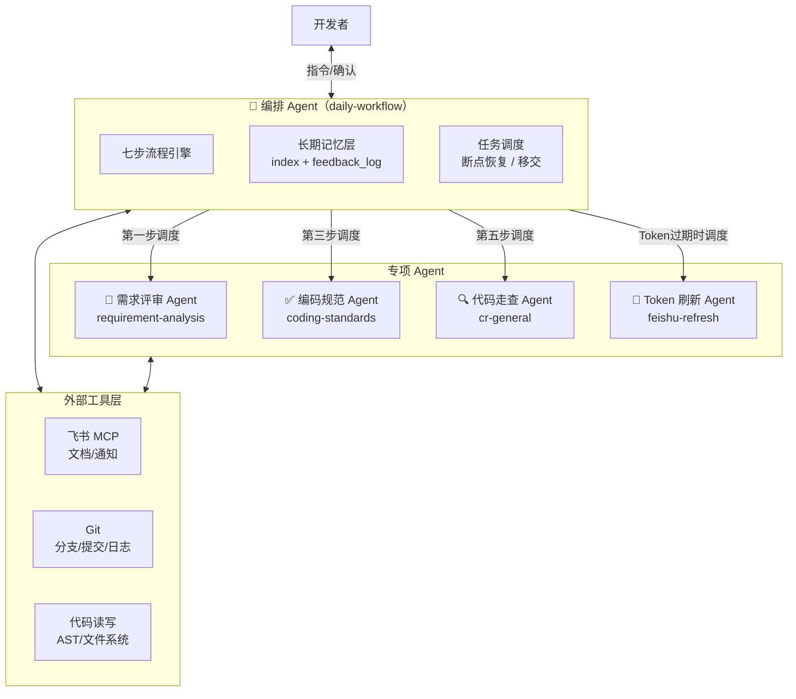
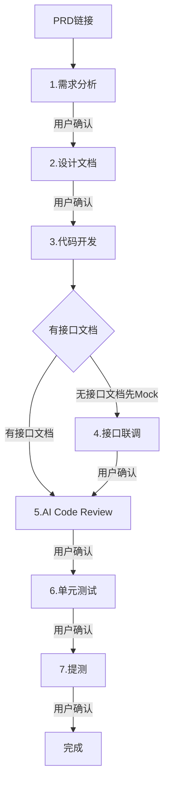
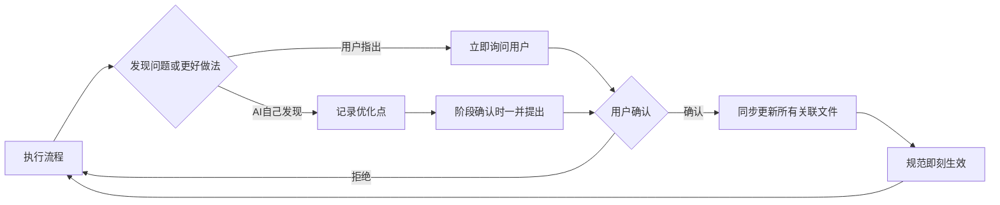
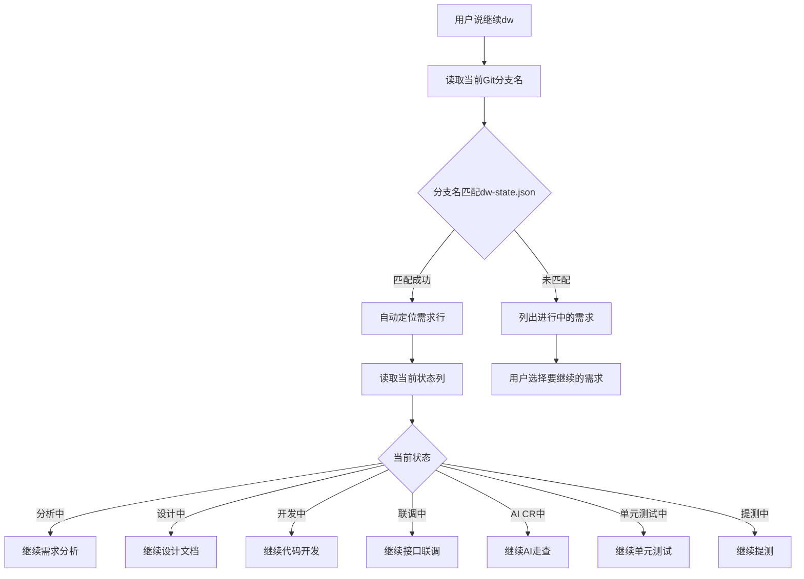

# 🚀 AI 驱动前端开发工作流：从 Harness 理念到 Spec-Driven 工程实践

> ⏰ **赶时间的同学直接看这里就够了**
>
> **做了什么**：搭建了一套 AI 辅助的前端开发全流程自动化 Skill，覆盖需求分析、设计文档、代码开发、接口联调、AI CR、单元测试、提测七个阶段，全程自动记录日报，支持一键生成周报和季度总结。
>
> **效果如何**：用一个真实需求（咖啡时段售卖设置）跑通了完整流程，纯需求流程耗时约 51 分钟完成从需求分析到提测，文档类工作提效 80%+，日报实现零人工。
>
> **亮点**：
> - 🧠 自我学习：AI 在使用过程中主动发现问题并优化规范，skill 越用越顺手
> - 🔗 断点重连：通过 Git 分支名自动匹配需求上下文，会话中断后说"继续"即可恢复
> - 🔄 反馈闭环：开发变更自动同步设计文档，单元测试发现的 Bug 自动记录到测试报告，文档始终是最终态
> - 📐 Spec-Driven：规范即配置，改 Markdown 即生效，团队共享一套标准
>
> **当前瓶颈**：飞书 MCP 文档精确编辑有局限

---

## 一、背景与动机

前端开发日常工作中，大量时间消耗在非编码环节：需求分析文档编写、设计文档整理、提测文档填写、日报周报汇总、单元测试编写……这些环节虽然不直接产出代码，却是保障交付质量和团队协作效率的关键。

传统模式下，这些环节高度依赖人工经验，存在三个核心痛点：

- ❌ **规范执行不一致**：每次写文档格式不同，遗漏关键信息
- 🔄 **重复劳动多**：提测文档、周报、日报等大量信息可以从已有数据中自动提取
- 🔗 **上下文断裂**：需求分析、设计、开发、测试之间缺乏自动化的信息传递

---

## 二、设计理念

### 🤝 Harness 理念：让 AI 成为工程流程的执行引擎

本工作流的核心设计理念借鉴了 Harness 的自动化编排思想——将前端开发全生命周期抽象为一条可编排、可追踪、可回溯的流水线，AI 作为流水线的执行引擎，开发者作为决策者和审核者。

| 特性 | 说明 |
|------|------|
| 🤝 人机协作，人做决策 | 每个阶段都有确认点，AI 生成草案，人来拍板 |
| ⚡ 数据驱动，自动流转 | 需求名、分支名、文档链接等上下文信息在流程中自动传递，Git 分支名作为需求唯一标识，实现会话中断后的自动重连 |
| 🎁 异常可控，断点可续 | 任意步骤可暂停，恢复时通过当前 Git 分支名自动匹配 `dw-state.json` 中的需求条目，直接从断点继续 |
| 🔄 协作移交，无缝接手 | 需求中途移交时自动生成移交摘要（进度、待办、关键决策），接手人切到分支后说"继续 dw"即可接上；支持团队共享模式零成本移交 |

### 📐 Spec-Driven 开发：规范即代码

借鉴 Spec-Driven Development 的思想，将团队的开发规范、文档模板、自测标准全部编码为结构化的 Markdown 规范文件（references），AI 在执行每个阶段时严格读取并遵循这些规范。

> 💡 规范不再是"写在 Wiki 上没人看的文档"，而是 AI 每次执行时必须加载的"配置文件"。规范的更新即刻生效，无需培训、无需通知。

### 🔄 反馈闭环：文档与代码始终同步

| 机制 | 说明 |
|------|------|
| 🔄 开发 → 设计文档反馈 | 代码开发过程中用户要求调整实现方案，修改完代码后自动同步更新飞书设计文档。设计文档不是一次性产物，而是随代码演进的活文档。 |
| 🐛 单元测试 → 测试报告反馈 | 单元测试中发现的源码 Bug 及修复方案，在修复完成后自动追加到测试报告。提测时测试人员可以直接看到完整的测试记录。 |

### 🧠 自我学习：规范随实践进化

工作流不是一成不变的静态配置。在实际使用过程中，AI 会主动识别流程中的问题和可优化点，按时机分类向用户提出改进建议——用户指出的问题当场响应，AI 自己发现的优化点攒到当前步骤确认时一并提出，不打断工作节奏。用户确认后，AI 自动更新 SKILL.md、references/*.md、README.md 和 REPORT.md 等所有关联文件，规范即刻生效。

> 🧠 **实际案例**：在首次跑通全流程的过程中，通过这个机制迭代了多项优化：
> - 日报格式从直接写关键词改为"完成xxx"+ 换行
> - 接口文档地址获取后自动回填设计文档
> - 开发中的实现方案变更自动同步设计文档
> - 单元测试发现的源码 Bug 自动记录到测试报告
> - 提测文档中无法自动获取的字段留空而非填"待补充"
> - Git 分支名作为需求唯一标识实现断点重连
>
> 每一条都来自实际使用中的反馈，而非预先设计。

### 🤖 Multi-Agent 架构：专项能力解耦与协作

从架构视角看，整个系统是一个 Multi-Agent 协作体系：



| Agent | 职责 | 独立使用 | 被编排调用 |
|-------|------|----------|------------|
| 编排 Agent（daily-workflow） | 流程编排、状态管理、记忆维护、任务调度 | — | — |
| 需求评审 Agent | PRD 质量评审 + 代码对照分析，卡点机制 | ✅ "审PRD" | 第一步 |
| 编码规范 Agent | 规范查询、代码风格检查 | ✅ "编码规范" | 第三步 |
| 代码走查 Agent | 6 维度走查 + 专项检查，输出报告 | ✅ "代码走查" | 第五步 |
| Token 刷新 Agent | 飞书 UAT 自动刷新（refresh_token → OAuth 降级） | ✅ "刷新飞书token" | Token 过期时 |

**与传统 Agent 框架的对比**：

| 能力 | 传统 Agent | 本系统 |
|------|-----------|--------|
| 自主决策 | ✅ | ✅ 流程自动推进，决策点停下等人 |
| 工具调用 | ✅ | ✅ 飞书 MCP + Git + 代码读写 |
| 长期记忆 | ✅ 向量数据库 | ✅ 结构化索引 + 反馈日志（纯文档，零依赖） |
| 多步规划 | ✅ | ✅ 七步流程 + 断点恢复 + 移交 |
| 自我优化 | ✅ Fine-tuning | ✅ RL 训练闭环（反馈驱动规范更新） |
| 多 Agent 协作 | ✅ | ✅ 编排 Agent 调度专项 Agent |
| 可移植性 | ❌ 绑定框架 | ✅ 纯 Markdown，跨平台导出 |

> 💡 本系统选择"规范即配置"而非"模型即能力"的路线——不依赖特定模型或框架，所有能力编码为 Markdown 规范文件，任何 AI 都能读取执行。这使得系统天然具备跨平台、跨模型的可移植性。

---

## 三、工作流全景



全程自动记录日报到本地 `daily-log.md`，支持一键生成周报和季度/年度总结。

### 🔄 反馈学习闭环



### 🔗 断点重连流程

当会话中断后，通过 Git 分支名自动恢复上下文：



---

## 四、贴近实际：规范来源于项目本身

| 规范来源 | 提取内容 | 示例 |
|----------|----------|------|
| `.eslintrc.json` | ESLint 规则 | `func-style: expression`、`camelcase`、`no-moment` |
| `.prettierrc.cjs` | 格式化配置 | 无分号、单引号、尾逗号、120字符行宽 |
| `package.json` | 技术栈约束 | React 17 + Ant Design 5 + TypeScript 4.x + Rematch + Rsbuild |
| 项目目录结构 | 分层规范 | `src/` 目录分层、路径别名（`@/` 和 `@@/`） |
| 自定义 ESLint 插件 | 项目特有规则 | `no-moment`、`no-CompactV4Moment` |

> ✅ 这确保了 AI 生成的代码能直接通过项目的 lint 检查，无需人工二次调整格式。

---

## 五、灵活性：每个规范都可定制

| 规范文件 | 控制什么 | 定制场景 |
|----------|----------|----------|
| `requirement-analysis` skill | 需求分析维度和卡点机制 | 增减分析维度、调整卡点阈值 |
| `development-design.md` | 设计文档的章节结构 | 增加架构图要求、调整模板字段 |
| `coding-standards` skill | 编码风格和技术栈约束 | 升级技术栈版本、新增/移除 lint 规则 |
| `unit-testing` skill | 单元测试的框架和策略 | 升级测试框架、调整 Mock 策略 |
| `test-submission` skill | 提测文档的字段和模板 | 修改固定值（测试人、应用名等） |
| `general-rules.md` | 流程通用规则 | 调整日报格式、修改状态术语 |
| `weekly-report.md` | 周报的内容结构 | 增加风险项、调整汇总维度 |
| `periodic-summary.md` | 季度/年度总结模板 | 对接不同的 KPI 体系 |
| `index-strategy.md` | 索引结构和检索策略 | 调整索引分组方式、增加检索维度 |
| `feedback-loop.md` | RL 训练闭环和反馈记录 | 调整优化触发条件、增加反馈分析维度 |
| `quick-log.md` | 快速记录的行为规则 | 调整默认状态、增加记录维度 |
| `handover.md` | 需求移交的流程和文档模板 | 调整移交文档结构、增加移交检查项 |
| `cross-platform-export.md` | 跨平台导出的目标和格式 | 新增目标平台、调整转换规则 |
| `bot-notification.md` | 飞书机器人通知的场景和消息格式 | 增减通知场景、调整消息模板 |
| `feishu-refresh` skill | 飞书 UAT Token 自动刷新 | 更换飞书应用凭证、调整 OAuth scope |
| `modules/*.md` | 模块专项规范 | 新增业务模块时创建对应规范文件 |

> ⚡ 修改规范文件后，下一次执行流程即自动生效，零成本推广。

---

## 六、提效分析

### 📊 量化提效

| 环节 | 传统耗时 | AI 辅助耗时 | 提效幅度 | 说明 |
|------|----------|-------------|----------|------|
| 需求分析文档 | 1-2h | 10-15min | ~80% | AI 自动读取 PRD 生成分析框架 |
| 设计文档 | 2-3h | 15-30min | ~80% | 自动生成组件设计、数据流图、修改文件清单 |
| 代码开发 | 视需求 | 视需求 | ~30-50% | AI 按规范生成代码骨架 |
| 接口联调 | 1-2h | 10-20min | ~70% | 自动对照接口文档替换 Mock |
| 单元测试 | 30-60min | 5-10min | ~80% | 自动生成测试代码并运行，修复失败用例 |
| 提测文档 | 20-30min | 3-5min | ~85% | 模板自动填充 |
| 日报 | 5-10min/天 | 0min | 100% | 流程执行时自动记录 |
| 周报 | 30-60min | 3-5min | ~90% | 从日报数据自动汇总 |
| 季度总结 | 3-5h | 15-30min | ~85% | 自动统计数据、提炼亮点 |

### ✅ 质量提效

| 维度 | 说明 |
|------|------|
| 📏 规范一致性 | 每次输出严格遵循同一套规范，消除个人风格差异 |
| 🔍 遗漏率降低 | 单元测试自动覆盖正常路径、边界条件、错误处理、状态流转、用户交互五大维度，AI 自动修复失败用例 |
| 🔗 上下文完整性 | 需求名、分支名、文档链接等信息在流程中自动传递，避免信息断裂 |
| 📋 可追溯性 | 所有文档和状态变更记录在飞书，形成完整的需求交付链路 |

### 📈 度量埋点（自动采集）

从 05/12 起，每个需求在七步流程中自动采集度量数据，无需人工操作：

| 度量维度 | 采集内容 | 用途 |
|----------|----------|------|
| 阶段耗时 | 每个阶段的开始/结束时间、持续分钟数 | 识别瓶颈阶段，量化提效 |
| 交互消耗 | 每个阶段的 AI 交互轮次、修改次数、驳回次数 | 验证"越用越好"假设 |
| 质量指标 | CR 问题数/误报数、测试覆盖率、首次通过率、Bug 发现数 | 量化质量提升 |
| 需求复杂度 | 规模(S/M/L/XL)、类型、涉及模块数 | 按复杂度分组对比 |

**数据输出节点**（用户主动触发时才输出）：
- 写周报时：自动包含本周效率数据
- 季度/年度总结时：输出趋势分析和提效百分比
- 用户说"看看效率数据"/"度量报告"时：单独输出汇总
- 第 5 个需求完成时：自动建立 baseline，后续数据与 baseline 对比

---

## 七、使用方式

### 🚀 快速开始

1. 配置飞书 MCP
2. 在 AI 编程工具中输入 `开启 dw` + PRD 飞书链接
3. 按提示逐步确认即可

### 📢 常用指令

| 指令 | 效果 |
|------|------|
| `开启 dw` + PRD链接 | 🚀 启动七步开发流程 |
| `继续 dw` | 🔗 通过 Git 分支名自动匹配需求，从中断处恢复 |
| `更新 dw` + 状态 | 📝 手动更新需求状态（如"已上线"） |
| `记录` / `log` + 工作内容 | 📌 快速记录零散工作 |
| `移交 [需求名] 给 [人名]` | 🤝 生成移交文档并通知接手人 |
| `导出 skill 到 [平台]` | 📦 将 skill 导出为其他 AI IDE 格式 |
| `写周报` | 📊 自动生成本周周报 |
| `Q1总结` / `年度总结` | 📋 生成季度或年度总结 |

---

## 八、当前瓶颈与待解决问题

| 问题 | 影响 | 临时方案 |
|------|------|----------|
| ⚠️ 飞书 MCP 能力边界 | 不支持电子表格/多维表格 | 日报和进度跟踪已改为本地文件（`daily-log.md` + `dw-state.json`），不再依赖飞书表格 |
| 📝 飞书文档精确编辑局限 | replace_all 容易误伤其他内容 | 优先 replace_range + 精确定位，表格用 selection_by_title |

---

## 九、总结

> 🎯 本工作流将前端开发中"需求到提测"的全链路进行了自动化编排，核心价值在于：
>
> 1. **从项目实际出发**：规范提炼自真实代码库，而非理论模板
> 2. **Spec-Driven 执行**：规范即配置，修改即生效，团队共享一套标准
> 3. **Harness 式编排**：七步流水线（含 AI CR）+ 确认点 + 异常处理 + 断点恢复，流程可控可追溯
> 4. **全链路提效**：文档类工作平均提效 80%+，日报实现零人工，周报/总结一键生成
> 5. **自我进化**：规范文件是纯 Markdown，AI 在使用过程中根据用户习惯和偏好持续微调。每个人用出来的 skill 都是最适合自己的版本，而规范跟着项目走，团队成员 pull 下来即可共享

AI 不是替代开发者，而是将开发者从重复性的文档和流程工作中解放出来，让更多时间聚焦在真正需要创造力的业务逻辑和技术方案上。

---

## 十、实践示例：咖啡时段售卖设置

### 📌 需求概况

| 项目 | 内容 |
|------|------|
| 需求名称 | 咖啡时段售卖设置（中台业务开关部分） |
| 需求难度 | 小型需求（在现有业务开关模块中新增一个参数配置项） |
| PRD 来源 | 飞书 Wiki 文档 |
| 接口情况 | 复用现有接口，后端新增参数字段 |

### ⏱️ 时间线

| 阶段 | 起止时间 | 耗时 | 说明 |
|------|----------|------|------|
| 需求分析 | 13:30-13:38 | ~8min | 读取 PRD、生成分析文档、输出 10 条待澄清问题 |
| 设计文档 | 13:38-13:42 | ~4min | 分析代码结构、生成设计文档 |
| 代码开发 | 14:00-14:10 | ~10min | 创建分支、读取接口文档、编写组件 |
| 单元测试 | 14:49-15:10 | ~21min | 生成测试代码并运行、发现并修复 2 个源码 Bug |
| 提测 | 15:10-15:18 | ~8min | 生成提测文档、自动填充上下文 |
| **合计** | | **~51min** | 纯需求流程耗时 |

> 💡 实际会话总时长约 1 小时 48 分钟，其中约 57 分钟用于 skill 规范优化（一次性投入，后续需求直接受益）。

### 🔧 过程中的 skill 优化（共 12 项）

1. 日报格式改为"完成xxx"+ 换行
2. 第一步即创建 Git 分支（原在第三步）
3. Git 分支名作为断点重连标识
4. 接口文档地址自动回填设计文档
5. 开发变更自动同步设计文档
6. 单元测试发现的源码 Bug 自动记录到测试报告
7. 提测文档留空而非"待补充"
8. 提测文档使用 mention-user 真实 @
9. 单元测试阶段跳过重复的 ESLint 检查
10. 新增自我学习与优化机制
11. 新增 AI Code Review 阶段（第五步），走查后自动更新飞书报告
12. 触发指令从"开始开发"改为 `开启 dw` / `继续 dw` / `更新 dw` 系列指令

---

## 十一、持续迭代：04/24 优化记录

> 💡 基于实际使用反馈和自我学习机制，本次对 daily-workflow skill 进行了多项优化，进一步提升流程的严谨性、灵活性和自测覆盖度。

### 本次优化清单

| 序号 | 优化项 | 说明 |
|------|--------|------|
| 1 | 状态流转命名统一 | 将"待联调"→"联调中"、"待自测"→"自测中"，全链路统一为"X中"表示进行态、"已X"表示完成态，语义更清晰 |
| 2 | 变更同步规则 | 新增强制规则：修改 SKILL.md 或任何 references/*.md 后，必须立即检查并同步更新所有关联文件（README.md、REPORT.md 等），不等用户发现再补改 |
| 3 | 自我学习询问时机分类 | 将优化建议的询问时机分为两类：用户指出的问题当场响应（立即询问），AI 自己发现的优化点攒到当前步骤确认时一并提出（阶段结束时询问），避免打断工作节奏 |
| 4 | 模块专项规范机制 | 新增 references/modules/ 目录，支持按业务模块定义专项规范（额外编码约束、CR 检查项、测试场景、接口约定）。第一步需求分析时自动匹配或手动指定，后续步骤自动叠加到通用规范上 |
| 5 | 单元测试自动生成 | 第六步由 self-testing 手工自测清单替换为 unit-testing 自动生成测试代码并运行，失败用例自动修复（最多 3 次），提测前只需确认 QA 冒烟通过 |

### 优化后的状态流转链

```
分析中 → 设计中 → 开发中 → 联调中(可跳过) → AI CR中 → 单元测试中 → 提测中 → 已提测 → 测试中 → 已上线
```

### 优化后的单元测试数据来源

| 来源 | 说明 |
|------|------|
| **AI 推导** | 基于需求分析 + 设计文档 + 代码自动生成测试用例（现有能力） |
| **模块专项** | 从 modules/*.md 加载该模块特有的测试场景（本次新增） |
| **修复循环** | 自动运行测试并修复失败用例，最多 3 次重试（本次新增） |

### 优化后的文件结构变化

```
references/
├── modules/              # 【新增】模块专项规范目录
│   ├── _template.md      # 模板文件，新增模块时复制
│   └── xxx.md            # 各模块专项规范
├── unit-testing/         # 【替换】self-testing → unit-testing，自测清单 → 自动生成+运行单测
├── general-rules.md      # 【更新】新增"模块专项规范"和"变更同步规则"章节
└── ...
```

> **小结**：本次优化聚焦三个方向——流程严谨性（状态命名统一 + 变更同步规则）、灵活性（模块专项规范）、测试自动化（self-testing 自测清单 → unit-testing 自动生成+运行单测）。所有优化均通过自我学习机制在实际使用中识别并迭代，改完即生效。

---

## 十二、持续迭代：04/30 优化记录

> 💡 基于对长期使用场景的深度思考，本次对 skill 体系进行了架构级重构和多项新能力建设，从"单人单需求工具"升级为"多人协作 + 长期记忆 + 自我进化"的 Multi-Agent 体系。

### 本次优化清单

| 序号 | 优化项 | 说明 |
|------|--------|------|
| 1 | Skill 拆分：编码规范独立 | 将 coding-standards 从 daily-workflow 的 references 中拆出为独立 skill，支持单独触发（"编码规范"/"怎么写"），daily-workflow 第三步自动引用 |
| 2 | Skill 拆分：需求分析独立 | 将 requirement-analysis 拆为独立 skill，新增代码对照分析层（读取现有代码评估 PRD 兼容性），支持卡点机制（通过/有疑问/严重问题三级结论），用户拥有最终决策权 |
| 3 | 结构化索引（长期记忆层） | 新增 Kiro/index 全局索引文档，按季度分组存需求索引 + 零散工作索引 + 技术标签索引。每个需求管理文件头部加摘要区。不同场景走不同检索深度（周报只读表格，季度总结先读索引再按需下钻），避免全量读文档 |
| 4 | 快速记录 | 新增轻量记录入口（"记录"/"log" + 内容），用于记录不走七步流程的零散工作（bug fix、会议、调研等），确保周报和总结时数据完整 |
| 5 | 需求移交 | 新增"移交 [需求名] 给 [人名]"指令，支持模糊匹配需求名，自动生成移交文档（进度/分支/文档链接/待办/关键决策）并飞书 @ 通知接手人。对方无论是否使用 skill 都能通过移交文档接手 |
| 6 | RL 训练闭环 | 新增 Kiro/feedback_log 反馈日志，将用户每次确认/修改/驳回结构化记录。同类修改≥2次提出规范更新建议，驳回≥1次立即标记高优，确认≥3次固化为最佳实践。自动提取用户偏好（编码/文档/沟通/决策） |
| 7 | 跨平台导出 | 新增"导出 skill 到 [平台]"指令，支持 Cursor / Claude Code / Windsurf / Trae 四个平台，核心内容不变只转换包装格式，实现规范资产跨平台复用 |
| 8 | 飞书机器人通知 | 接入飞书 Webhook 机器人，每个流程步骤完成后自动发送通知到个人群（需求名 + 完成事项 + 文档链接），不用一直盯着 IDE |
| 9 | SKILL.md 瘦身重构 | 将 SKILL.md 从 400+ 行瘦身到约 100 行，详细规范全部拆到 references 下独立文件（index-strategy / handover / cross-platform-export / quick-log / feedback-loop / bot-notification），SKILL.md 只保留流程骨架和引用 |
| 10 | 日报本地化 | 日报记录从飞书电子表格迁移到本地 `daily-log.md`，进度跟踪统一用 `dw-state.json`；飞书只用于需要共享的文档输出 |
| 11 | Multi-Agent 架构视图 | 在 REPORT 中新增 Agent 架构视图，将现有 skill 体系用 Multi-Agent 协作框架重新包装：编排 Agent（daily-workflow）调度需求评审 / 编码规范 / 代码走查三个专项 Agent |

### 优化后的 Skill 架构

```
skills/
├── daily-workflow/           # 编排 Agent：流程引擎 + 状态管理 + 记忆维护
│   ├── SKILL.md              # 精简流程骨架（~100行）
│   └── references/           # 12 个规范文件
├── requirement-analysis/     # 专项 Agent：PRD 评审 + 代码对照 + 卡点
├── coding-standards/         # 专项 Agent：编码规范查询 + 风格检查
└── cr-general/               # 专项 Agent：6 维度走查 + 专项检查
```

### 优化后的能力矩阵

| 能力 | 说明 |
|------|------|
| **长期记忆** | index 索引 + feedback_log + 按月归档，跨会话无缝续接 |
| **自我进化** | RL 训练闭环，反馈驱动规范更新，越用越贴合团队 |
| **度量驱动** | 自动采集阶段耗时/交互消耗/质量指标，用数据验证提效假设 |
| **跨平台可移植** | 纯 Markdown 规范，一键导出到 Cursor / Claude / Windsurf / Trae |

> **小结**：本次迭代从架构层面完成了三个升级——从单 skill 到 Multi-Agent 协作体系，从无记忆到结构化长期记忆 + RL 训练闭环，从单人使用到支持需求移交和跨平台导出。SKILL.md 瘦身 75%，所有新能力按"骨架 + 引用"模式组织，可维护性大幅提升。

---

## 十三、持续迭代：05/07 优化记录

本次迭代重点解决了飞书 Token 过期导致工作流中断的痛点，将刷新能力封装为独立 skill 并集成到 daily-workflow 的 Multi-Agent 体系中。

### 本次优化清单

- **飞书 Token 自动刷新 skill**：新建 feishu-refresh 独立 skill，支持 refresh_token 静默刷新（30天有效）→ OAuth 浏览器授权降级，新 token 自动写入 MCP 配置文件。用户说"刷新飞书token"即可触发，也支持飞书 MCP 报 token 过期时自动修复
- **MCP 自动重连**：feishu-refresh skill 刷新 UAT 后自动重建 MCP 连接，Kiro 手动刷新 MCP 即可恢复全部飞书功能
- **daily-workflow 集成 feishu-refresh**：SKILL.md 新增 feishu-refresh 为关联 skill，流程中飞书 MCP 报 token 过期时自动调用刷新 + 重连；删除旧的 feishu_uat.sh（仅支持 OAuth，无 refresh_token，不自动写配置）；同步更新 README.md 和 REPORT.md 所有关联文档

### 优化后的 Skill 架构

```
skills/
├── daily-workflow/           # 编排 Agent：流程引擎 + 状态管理 + 记忆维护
│   ├── SKILL.md              # 精简流程骨架（~100行）
│   └── references/           # 12 个规范文件
├── requirement-analysis/     # 专项 Agent：PRD 评审 + 代码对照 + 卡点
├── coding-standards/         # 专项 Agent：编码规范查询 + 风格检查
├── cr-general/               # 专项 Agent：6 维度走查 + 专项检查
└── feishu-refresh/           # 专项 Agent：飞书 UAT 自动刷新 + MCP 重连
    ├── SKILL.md
    ├── README.md
    └── scripts/
        └── feishu_uat_refresh.js
```

### 优化后的 Agent 职责

| Agent | 职责 | 独立使用 | 被编排调用 |
|-------|------|----------|------------|
| 编排 Agent（daily-workflow） | 流程编排、状态管理、记忆维护 | — | — |
| 需求评审 Agent（requirement-analysis） | PRD 质量评审 + 代码对照 | ✅ "审PRD" | 第一步 |
| 编码规范 Agent（coding-standards） | 规范查询、代码风格检查 | ✅ "编码规范" | 第三步 |
| 代码走查 Agent（cr-general） | 6 维度走查 + 专项检查 | ✅ "代码走查" | 第五步 |
| Token 刷新 Agent（feishu-refresh） | 飞书 UAT 自动刷新 + MCP 重连 | ✅ "刷新飞书token" | Token 过期时 |

> **小结**：本次迭代解决了工作流的最大痛点——飞书 Token 每 2 小时过期导致流程中断。通过将刷新能力封装为独立 skill（feishu-refresh）并集成 MCP 自动重连机制，用户说"刷新飞书token"即可一键恢复。Kiro 手动刷新 MCP 连接即可，Claude Code 需重启。同时更新了 README、REPORT 等所有关联文档，保持了 skill 体系的文档一致性。

---

## 十四、持续迭代：05/08 优化记录

本次迭代对 skill 体系进行了架构级重构——建立三层文件架构（通用 / 可配置 / 可学习），将所有 SKILL.md 从技术栈绑定中解放出来，使 skill 体系真正成为可跨团队、跨技术栈复用的通用工具。

### 本次优化清单

| 序号 | 优化项 | 说明 |
|------|--------|------|
| 1 | 三层文件架构 | 确立 SKILL.md（通用规则）/ references/（用户可编辑的引导配置）/ LEARNING.md（AI 管理的学习反馈）三层架构。SKILL.md 不包含任何技术栈特定内容，换团队时只需替换 references/ 目录 |
| 2 | references/ 目录全覆盖 | 6 个功能型 skill 全部创建 references/ 目录：coding-standards → tech-stack.md、cr-general → specialized-checks.md、requirement-analysis → frontend-concerns.md、self-testing → testing-checklist.md（已替换为 unit-testing → testing-framework.md）、development-design → design-template.md、feishu-doc → report-style.md |
| 3 | SKILL.md 通用化 | 6 个功能型 skill 的 SKILL.md 全部去除"前端"和 React/Antd/TypeScript 特定引用。coding-standards 从 600 行精简为通用分类骨架（具体规则移入 references/tech-stack.md），cr-general 的 React/TS 检查项改为通用描述（具体检查项移入 references/specialized-checks.md） |
| 4 | pm_url 字段 | daily-workflow 已移除项目管理地址字段（飞书 API 无法读写项目链接卡片，维护成本高于收益） |
| 5 | 飞书文档输出风格偏好 | feishu-doc 新增 references/report-style.md，将个人文档风格偏好（章节标题、流程图、callout 色块、表格格式、布局节奏）从抽象描述转为可执行的触发条件 + 具体动作规则 |
| 6 | LEARNING.md 独立闭环 | 为 coding-standards、requirement-analysis、cr-general 三个功能型 skill 各创建 LEARNING.md，建立独立的反馈触发点、策略优化规则和规范沉淀机制 |
| 7 | README 同步更新 | 所有 skill 的 README 更新为通用描述 + "个性化配置"章节说明 references/ 用法；外层 skills/README.md 新增"三层架构"说明和完整目录结构 |

### 三层文件架构

| 层 | 文件 | 管理者 | 说明 |
|----|------|--------|------|
| 通用规则 | SKILL.md | AI 维护 | 通用流程定义，不包含技术栈特定内容 |
| 引导配置 | references/ | 用户编辑 | 技术栈/团队/个人偏好，换团队时替换即可 |
| 学习反馈 | LEARNING.md | AI 管理 | 基于用户反馈自动学习，记录偏好和沉淀规范 |

### 优化后的 Skill 架构

```
skills/
├── daily-workflow/           # 编排 Agent
│   ├── SKILL.md              # 通用流程骨架
│   ├── references/            # 可替换的引导配置
│   └── references/           # 规范文档集
├── requirement-analysis/     # 需求评审 Agent
│   ├── SKILL.md              # 通用流程（无"前端"标识）
│   ├── references/
│   │   └── frontend-concerns.md  # 前端需求关注点
│   └── LEARNING.md
├── development-design/       # 设计文档 Agent
│   ├── SKILL.md              # 通用流程
│   ├── references/
│   │   └── design-template.md    # React + Antd 5 模板配置
│   └── LEARNING.md
├── coding-standards/         # 编码规范 Agent
│   ├── SKILL.md              # 通用分类骨架（具体规则在 references）
│   ├── references/
│   │   └── tech-stack.md     # React + Antd 5 完整技术栈规范
│   └── LEARNING.md
├── cr-general/               # 代码走查 Agent
│   ├── SKILL.md              # 通用检查维度（技术栈检查项在 references）
│   ├── references/
│   │   └── specialized-checks.md # 专项检查（含 React+TS 代码规范专项）
│   └── LEARNING.md
├── unit-testing/              # 单元测试 Agent
│   ├── SKILL.md              # 通用测试流程
│   ├── references/
│   │   └── testing-framework.md  # Jest + React 测试框架配置
│   └── LEARNING.md
├── feishu-doc/               # 飞书文档 Agent
│   ├── SKILL.md
│   ├── references/
│   │   └── report-style.md          # 文档输出风格偏好
│   └── LEARNING.md
├── feishu-refresh/           # Token 刷新 Agent
└── cross-platform-export/    # 跨平台导出 Agent
```

### 核心设计原则

- **SKILL.md 是通用的，references/ 是可替换的**：默认 references 面向 React + Antd 5 前端，换成 Vue/Angular/后端项目只需替换对应参考配置文件
- **SKILL.md 不列具体 references 文件名**：避免替换文件后还要改 SKILL.md，只说"读取 references/ 目录下所有文件"
- **具体文件名和说明只在 README.md 中出现**：README 是给人看的文档，改了不影响 AI 执行逻辑

> **小结**：本次迭代从架构层面完成了 skill 体系从"前端专用工具"到"通用可配置工具"的升级。核心变化是建立三层文件架构（通用/可配置/可学习），将所有技术栈特定内容从 SKILL.md 抽离到 references/，使得换团队/换技术栈时只需替换 references/ 目录即可适配，SKILL.md 无需任何修改。同时为 3 个功能型 skill 补齐了独立的学习反馈闭环，确保每个 skill 作为独立能力单元具备自我进化能力。

---

## 十五、持续迭代：05/09 优化记录

本次迭代聚焦两件事：一是将 skill 体系从"前端专用"彻底打磨为"通用可配置"，所有 SKILL.md 中的技术栈残留全部清除；二是补齐 Spec 质量标准和跨团队适配指引，让其他人拿到这套 skill 时知道怎么改、改哪里。

### 本次优化清单

| 序号 | 优化项 | 说明 |
|------|--------|------|
| 1 | unit-testing SKILL.md 通用化 | 去除 React/前端特定术语（组件/Hook/Reducer → 导出单元/有状态的单元/交互式单元），去除硬编码的 references 文件名，只说"读取 references/ 目录下所有文件" |
| 2 | cr-general SKILL.md 通用化 | 重写前 5 个检查维度为通用描述（前端专项检查项保留在 references/specialized-checks.md），新增"可验证要求"：必须逐维度逐项报告结果，不能只写"已检查" |
| 3 | testing-framework.md 重命名 | 重命名为 frontend-testing.md，文件名准确反映其前端特定内容，避免其他技术栈用户误以为通用 |
| 4 | Spec 质量标准 | 建立 6 项 Spec 质量标准（清晰&明确、可执行、可回溯、可学习、可验证、无冲突），写入外层 README.md 作为所有规范文件的编写准则 |
| 5 | 规范溯源落地 | 6 个功能型 skill 的 LEARNING.md 新增"规范溯源"章节，追踪每条规范的来源（初始预设/踩坑沉淀/用户指定/团队规范）、触发场景和加入日期，实现可回溯 |
| 6 | test-submission 独立拆分 | 将提测文档从 daily-workflow/references/test-submission.md 拆为独立 skill（SKILL.md + LEARNING.md + README.md + references/frontend-submission.md + output/），与其他功能型 skill 对齐三层架构 |
| 7 | 跨团队适配指引 | 外层 README.md 新增"适配新技术栈/新团队"章节：列出需替换的 6 个 references 文件、不需要动的文件、可移除的 skill、4 种适配场景（React→Vue、前端→后端、前端→移动端、同技术栈换团队），并给出渐进式建议 |
| 8 | 交叉引用全量更新 | cross-platform-export skill 列表新增 test-submission；daily-workflow 的 SKILL.md、README.md、REPORT.md、general-rules.md 中 test-submission.md 引用全部更新为 test-submission skill；外层 README.md 目录结构同步更新 |

### Spec 质量标准

| 特质 | 含义 | 检验方式 |
|------|------|----------|
| 清晰 & 明确 | 无歧义，每条规则只有一种理解 | 换一个人/AI 读，理解一致 |
| 可执行 | AI 读了知道做什么、按什么顺序、遇到什么情况怎么处理 | 能直接转化为操作步骤 |
| 可回溯 | 规则的来源可追踪 | 每条规则能回答"这条从哪来的" |
| 可学习 | 规则可以基于反馈进化 | 有反馈机制和沉淀路径 |
| 可验证 | 能检查规则是否被执行、执行是否正确 | 有产出物可校验 |
| 无冲突 | 规则之间不矛盾，跨文件一致 | 变更一处时能确认关联文件同步 |

### 跨团队适配指引要点

- **只需替换 references/ 下的 6 个技术栈相关文件**（tech-stack.md、specialized-checks.md、frontend-testing.md、frontend-concerns.md、design-template.md、frontend-submission.md），保持文件名不变只换内容
- **SKILL.md、LEARNING.md、daily-workflow/references/ 不需要动**
- **不用飞书可删除 feishu-doc + feishu-refresh，不需要提测文档可删除 test-submission**
- **渐进式建议**：先跑一轮默认配置，AI 通过 LEARNING.md 学习偏好，逐步沉淀为团队专属配置

### 优化后的 Skill 架构

```
skills/
├── daily-workflow/           # 编排 Agent：流程引擎 + 状态管理 + 记忆维护
│   ├── SKILL.md              # 精简流程骨架
│   └── references/           # 规范文档集（不含技术栈特定内容）
├── requirement-analysis/     # 需求评审 Agent
│   ├── SKILL.md              # 通用流程
│   ├── references/
│   │   └── frontend-concerns.md
│   └── LEARNING.md           # 含规范溯源
├── development-design/       # 设计文档 Agent
│   ├── SKILL.md              # 通用流程
│   ├── references/
│   │   └── design-template.md
│   └── LEARNING.md           # 含规范溯源
├── coding-standards/         # 编码规范 Agent
│   ├── SKILL.md              # 通用分类骨架
│   ├── references/
│   │   └── tech-stack.md
│   └── LEARNING.md           # 含规范溯源
├── cr-general/               # 代码走查 Agent
│   ├── SKILL.md              # 通用检查维度 + 可验证要求
│   ├── references/
│   │   └── specialized-checks.md
│   └── LEARNING.md           # 含规范溯源
├── unit-testing/             # 单元测试 Agent
│   ├── SKILL.md              # 通用测试流程（无前端术语）
│   ├── references/
│   │   └── frontend-testing.md   # 【重命名】testing-framework → frontend-testing
│   └── LEARNING.md           # 含规范溯源
├── test-submission/          # 提测文档 Agent【新增独立 skill】
│   ├── SKILL.md
│   ├── references/
│   │   └── frontend-submission.md
│   ├── LEARNING.md           # 含规范溯源
│   ├── output/
│   └── README.md
├── feishu-doc/               # 飞书文档 Agent（可选）
│   ├── SKILL.md
│   ├── references/
│   │   └── report-style.md
│   └── LEARNING.md           # 含规范溯源
├── feishu-refresh/           # Token 刷新 Agent（可选）
└── cross-platform-export/    # 跨平台导出 Agent
```

### 优化后的 Agent 职责

| Agent | 职责 | 独立使用 | 被编排调用 |
|-------|------|----------|------------|
| 编排 Agent（daily-workflow） | 流程编排、状态管理、记忆维护 | — | — |
| 需求评审 Agent（requirement-analysis） | PRD 质量评审 + 代码对照 | ✅ "审PRD" | 第一步 |
| 设计文档 Agent（development-design） | 设计文档生成 | ✅ "写设计" | 第二步 |
| 编码规范 Agent（coding-standards） | 规范查询、代码风格检查 | ✅ "编码规范" | 第三步 |
| 代码走查 Agent（cr-general） | 6 维度走查 + 专项检查 | ✅ "代码走查" | 第五步 |
| 单元测试 Agent（unit-testing） | 测试生成 + 运行 + 修复 | ✅ "写单测" | 第六步 |
| 提测文档 Agent（test-submission） | 提测文档生成 + 自动填充 | ✅ "提测" | 第七步 |
| Token 刷新 Agent（feishu-refresh） | 飞书 UAT 自动刷新 + MCP 重连 | ✅ "刷新飞书token" | Token 过期时 |

> **小结**：本次迭代完成了 skill 体系从"前端专用"到"通用可配置"的最后一公里——所有 SKILL.md 中的技术栈残留清除干净，Spec 质量标准和规范溯源机制确保规范本身的质量和可维护性，跨团队适配指引让新用户拿到就知道怎么改。test-submission 拆为独立 skill 补齐了三层架构的完整性，十个 skill 现在全部对齐统一架构。

---

## 十六、持续迭代：05/12 优化记录

本次迭代对 skill 体系进行了系统性诊断和修复，从可联动、可追踪、可审核、可迁移、可团队五个维度识别问题并逐优先级解决，同时统一了"继续 dw"作为唯一恢复入口的设计。

### 本次优化清单

| 优先级 | 序号 | 优化项 | 说明 |
|--------|------|--------|------|
| P0 | 1 | 路径引用统一 | 所有 `~/.claude/skills/` 硬编码路径替换为 `{SKILLS_DIR}` 变量（18 个文件），全局 README 新增变量说明表 |
| P0 | 2 | MCP 默认路径适配 Kiro | `~/.claude.json` → `~/.kiro/settings/mcp.json`，feishu_uat_refresh.js 默认写入路径同步更新 |
| P0 | 3 | Token 刷新流程 Kiro 优先 | 从"Claude Code 优先"改为"Kiro 优先"，Kiro 手动刷新 MCP 即可，无需重启 |
| P1 | 4 | 步骤间显式数据传递 | dw-state.json 新增 `context` 字段（prd_summary / api_doc_url / design_decisions / affected_modules / tech_highlights / integration_notes），general-rules.md 新增维护规则 |
| P1 | 5 | LEARNING 机制激活 | 7 个 LEARNING.md 新增"零、首次执行引导"章节（首次使用时提示 + AI 自检清单），解决学习机制未运转问题 |
| P1 | 6 | Kiro 平台适配规范 | cross-platform-export/SKILL.md 新增完整的 Kiro 适配章节（加载机制 / 与 Claude Code 差异 / Steering+Hooks+Spec 增强 / 导入指引） |
| P1 | 7 | "继续 dw"统一恢复入口 | 取消独立"接手"触发词，将接手逻辑合并到"继续 dw"的 3 级分支匹配路径中（本地有→移交文档→未匹配） |
| P2 | 8 | skill 间接口契约 | 5 个功能型 skill 的 front-matter 新增 `inputs` / `outputs` 声明，明确步骤间数据依赖 |
| P2 | 9 | baseline 按复杂度分层 | metrics.md 中 baseline 结构改为 `global` + `by_size`（S/M/L/XL 各自独立），对比时优先同规模 |
| P2 | 10 | 执行时校验 | dw-state.json 每个 phase 新增 `checklist_completed` 字段，general-rules.md 新增各阶段校验内容定义 |
| P2 | 11 | 团队规范隔离 | LEARNING.md 用户偏好拆分为"个人偏好"（留本地）和"团队规范"（沉淀到 references），feedback-loop.md 新增分类判定和沉淀流程 |
| P2 | 12 | 飞书文档全部可选 | 6 个 references 文件补齐本地后端输出路径（feedback-loop / weekly-report / periodic-summary / quick-log / code-review / index-strategy） |
| P3 | 13 | 反馈类型判定规则 | feedback-loop.md 新增判定规则表（8 种用户表达→对应类型）+ 边界情况处理 |
| — | 14 | 通知消息加项目名 | bot-notification.md 前缀从固定 `[AI-docs]` 改为动态 `[{项目名}]`，支持多工作区并行时区分来源 |
| — | 15 | 飞书文档目录分层 | 需求文档统一收入 `AI-docs/需求文档/` 子目录，不再与 index / 周报等平铺混放 |

### 核心设计变更

#### "继续 dw"统一恢复流程

```
用户说"继续 dw"
    │
    ▼
读取当前 Git 分支名（唯一 key）
    │
    ▼
本地 dw-state.json 中查找
    │
    ├── 找到 → 读取 context + status → 从断点继续
    │
    └── 未找到 → 检查本地移交文档（分支名匹配）
                    │
                    ├── 有 → 从移交文档重建 dw-state → 继续
                    │
                    └── 没有 → 未匹配，提示用户
```

#### 飞书文档目录结构（优化后）

```
AI-docs/
├── index                   # 全局索引
├── feedback_log            # 反馈日志
├── 需求文档/               # 所有需求文档（按需求分子目录）
│   └── YYYYMMDD_[需求名]/
│       ├── 需求分析 / 设计文档 / 走查报告 / 单元测试报告 / 提测文档
│       └── 移交摘要（如有）
├── 周报/
└── 总结/
```

#### 本地存储结构

```
output/{项目名}/
├── dw-state.json           # 进度跟踪（始终本地）
├── daily-log.md            # 日报记录（始终本地）
├── dw-index.md             # 索引（无飞书配置时）
└── dw-docs/                # 文档（无飞书配置时）
```

#### skill 间接口契约（新增）

```
requirement-analysis
  inputs:  prd_source
  outputs: prd_summary, affected_modules, quality_conclusion, issue_list
      ↓
development-design
  inputs:  prd_summary, affected_modules
  outputs: design_decisions, tech_highlights, affected_files_table
      ↓
cr-general
  inputs:  affected_files_table, design_decisions
  outputs: cr_issues_total, cr_false_positives, cr_report
      ↓
unit-testing
  inputs:  affected_files_table
  outputs: test_coverage_percent, test_cases_total, test_first_pass_rate, bugs_found
      ↓
test-submission
  inputs:  prd_summary, branch, affected_modules, integration_notes
  outputs: test_submission_doc
```

### 相关文件变更（共 25+ 文件）

| 范围 | 文件 | 变更类型 |
|------|------|----------|
| 全局 | README.md | 新增 `{SKILLS_DIR}` 变量说明、Kiro 优先排序、删除"接手"触发词 |
| 全局 | config.example.json | uat_config_path 示例改为 Kiro 路径 |
| daily-workflow | SKILL.md | 路径统一、删除"接手"触发词和辅助能力行 |
| daily-workflow | README.md | 路径统一、"继续 dw"补充说明 |
| daily-workflow | output/.dw-state.template.json | 新增 context 字段、checklist_completed 字段 |
| daily-workflow | LEARNING.md | 新增首次执行引导、用户偏好分类 |
| daily-workflow/references | general-rules.md | 文档存放分层、上下文传递重写、中断与恢复重写、checklist 校验规则 |
| daily-workflow/references | feedback-loop.md | 存储位置双后端、反馈类型判定规则、偏好分类与沉淀路径 |
| daily-workflow/references | metrics.md | baseline 按复杂度分层 |
| daily-workflow/references | bot-notification.md | 前缀改为项目名 |
| daily-workflow/references | handover.md | 删除独立接手流程、飞书路径改为需求文档子目录 |
| daily-workflow/references | weekly-report.md / periodic-summary.md / quick-log.md / code-review.md / index-strategy.md | 补齐本地后端输出路径 |
| 功能型 skill | requirement-analysis / development-design / cr-general / unit-testing / test-submission 的 SKILL.md | 新增 inputs/outputs 契约 |
| 功能型 skill | 7 个 LEARNING.md | 新增首次执行引导章节 |
| feishu-doc | SKILL.md / README.md | 路径适配 Kiro、Token 刷新 Kiro 优先 |
| feishu-doc | scripts/feishu_uat_refresh.js | 默认路径改为 Kiro |
| cross-platform-export | SKILL.md | 当前平台改为 Kiro、新增 Kiro 适配规范 |

> **小结**：本次迭代是一次系统性的"体检+修复"——从五个维度（联动/追踪/审核/迁移/团队）诊断出 P0-P3 共 13 个问题，全部修复。核心变更三个：一是路径和环境全面适配 Kiro（P0），二是"继续 dw"统一为唯一恢复入口、分支名作为需求唯一 key（P1），三是 skill 间建立显式接口契约、LEARNING 机制激活、团队规范与个人偏好隔离（P1-P2）。skill 体系从"能用"升级为"好用+可维护+可协作"。


---

## 十七、持续迭代：05/14 优化记录

本次迭代将日报记录的存储后端从飞书文档表格彻底迁移为本地 Markdown 文件。

### 本次优化清单

| 序号 | 优化项 | 说明 |
|------|--------|------|
| 1 | 日报存储后端迁移 | 日报记录从飞书云文档表格迁移为本地 `daily-log.md`，彻底去除对飞书表格的依赖 |

### 变更动机

- 飞书 MCP 不支持电子表格/多维表格的读写，日报写入飞书表格需要额外的 workaround，维护成本高
- 日报是"自己看的"记录，不需要共享，走本地文件更轻量、更快捷、更省事
- 本地 Markdown 格式便于 AI 直接读写和汇总（周报/季度总结时直接解析），无需处理飞书 API 的格式转换

### 变更前后对比

| 维度 | 变更前 | 变更后 |
|------|--------|--------|
| 存储位置 | 飞书云文档（表格） | 本地 `daily-log.md` |
| 读写方式 | 飞书 MCP API | 直接文件读写 |
| 共享性 | 可共享（但实际只自己看） | 本地私有 |
| 可靠性 | 依赖飞书 Token + MCP 连接 | 零依赖，始终可用 |
| 周报汇总 | 需通过飞书 API 读取再解析 | 直接读取本地 md 文件 |

> **小结**：日报从飞书表格迁移到本地 `daily-log.md`，遵循"自己看的走本地，需要给别人看的走飞书"的存储原则。去除了对飞书表格能力的依赖，更轻量快捷，省去不必要的网络开销。
